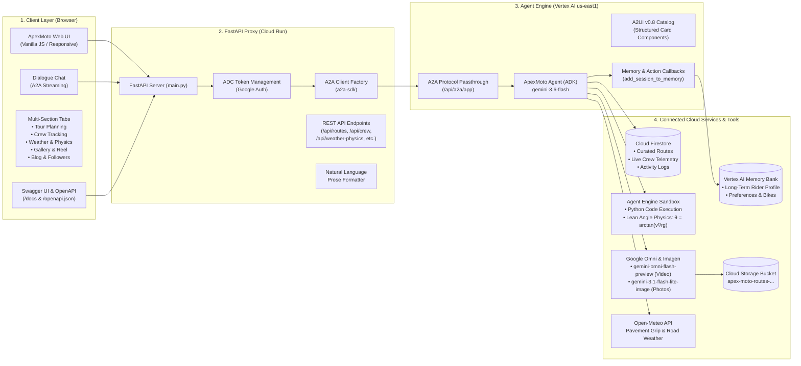

# ApexMoto • System Architecture & Service Topology

This document details the end-to-end architecture of ApexMoto, covering the Client UI, the FastAPI Gateway Proxy, the Vertex AI Agent Engine runtime, and connected Google Cloud services.

---

## 1. High-Level Architecture Diagram (Mermaid)

---

## 2. Component Specifications

### 1. Client Layer
- **Responsive Dark Racing Theme**: Styled with `#ff3344` racing red accents, glassmorphic panels, and Google Fonts (`Plus Jakarta Sans` & `JetBrains Mono`).
- **Interactive Multi-Sections**:
  - **Tour Planning**: Curated twisty routes scored on surface, technicality, and elevation.
  - **Convoy Radar**: Real-time crew positions, speed in mph, battery level, and ride status.
  - **Weather & Physics**: Client-side parameter adjustments sending calculations to remote sandbox math.
  - **Media Gallery**: Renders generated posters and streams Google Omni MP4 video reels.
  - **Blog & Followers**: Articles on trail braking / mountain passes and interactive follow toggles.

### 2. FastAPI Gateway Proxy (Cloud Run)
- **OpenAPI 3.1 & Swagger**: Interactive OpenAPI documentation served directly from `/docs` and `/redoc`.
- **A2A Protocol Client**: Connects to the Vertex AI Reasoning Engine passthrough using `a2a-sdk` client factory and Application Default Credentials (ADC).
- **Session Cache**: Retains context IDs per rider session to preserve agent conversational state.
- **Natural Language Parsing**: Automatically converts structured responses to natural language conversational text.

### 3. ApexMoto Agent (Vertex AI Agent Engine)
- **Model**: `gemini-3.6-flash`.
- **A2UI Schema Manager (v0.8)**: Generates structured flat cards (`Card`, `Column`, `Row`, `Text`, `Image`).
- **Tools**:
  1. `search_routes`: Queries Firestore routes by twistiness (1–10) and region.
  2. `get_route_details`: Surface, elevation gain, and route metadata.
  3. `add_custom_route`: Persists user-discovered twisties.
  4. `get_crew_status`: Live convoy telemetry.
  5. `check_road_weather`: Open-Meteo live pavement temperature and grip advice.
  6. `generate_route_image`: Scenic posters via `gemini-3.1-flash-lite-image`.
  7. `generate_route_video`: Cinematic video reels via `gemini-omni-flash-preview` in `location="global"`.
  8. `AgentEngineSandboxCodeExecutor`: Remote Python code execution for lean angle dynamics.
  9. `record_user_social_action`: Persistent social event logger.

### 4. Vertex AI Memory Bank
- **PreloadMemoryTool**: Loads rider preferences and bike specs into context at session initialization.
- **`generate_memories_callback`**: Captures rider habits, preferred roads, and convoy buddies for cross-session continuity.

---

## 3. Excalidraw Visual Diagram

The standalone visual Excalidraw diagram is saved as:
👉 **[`architecture.excalidraw`](file:///config/Desktop/BuildWithGemini/architecture.excalidraw)**

You can import this file directly into [excalidraw.com](https://excalidraw.com) to view, edit, or export the diagram as SVG/PNG.
